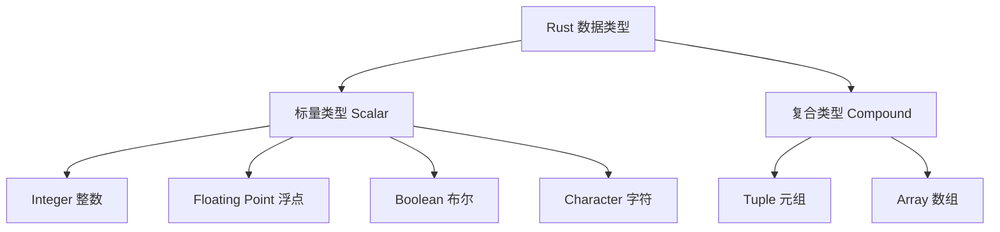
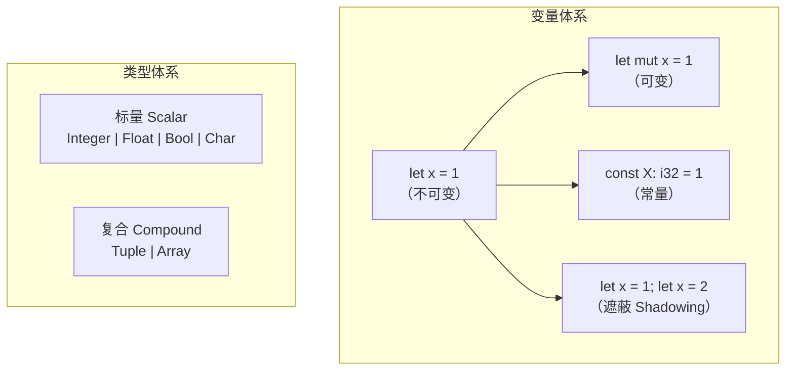

## 变量 & 可变性

Rust 中通过 `let` 声明变量。**默认情况下，变量是不可变的（immutable）**——这是 Rust 在安全性上的重要设计决策。

```rust
let some_number = 1;
// some_number = 2; // ❌ 编译错误：变量默认不可变
```

如果需要修改变量的值，必须使用 `mut` 关键字显式声明：

```rust
let mut another_number = 2;
another_number = 3; // ✅ 可以修改
println!("{}", another_number); // 3
```

### 为什么默认不可变？

| 设计考量 | 说明 |
|----------|------|
| 安全性 | 防止意外的值修改，减少 Bug |
| 并发友好 | 不可变数据天然线程安全，无需加锁 |
| 编译器优化 | 不可变值便于编译器做更激进的优化 |
| 可读性 | 一眼就能知道哪些值会变、哪些不会 |

---

## 常量 Constants

常量使用 `const` 声明，与变量的关键区别：

```rust
const SPECIAL_NUMBER: i32 = 3;
const THREE_HOURS_IN_SECONDS: u32 = 60 * 60 * 3;
```

### const 与 let 的区别

| 特性 | `const` | `let` |
|------|---------|------|
| 可变性 | 永远不可变 | 默认不可变，可加 `mut` |
| `mut` 关键词 | ❌ 不可使用 | ✅ 可选使用 |
| 类型标注 | ✅ **必须标注类型** | 通常可自动推断 |
| 作用域 | 任意作用域（包括全局） | 函数/代码块作用域 |
| 赋值表达式 | 仅常量表达式 | 任意表达式（包括运行时计算） |
| 命名约定 | `SCREAMING_SNAKE_CASE` | `snake_case` |

---

## 变量遮蔽 Shadowing

Rust 允许用 `let` 重复声明同名变量，**本质是创建了一个新变量**，旧变量被"遮蔽"：

```rust
let my_number = 1;
let my_number = 2;          // 遮蔽前一个 my_number
let my_number = my_number + 5; // 基于前一个值计算
println!("{}", my_number);  // 7
```

### Shadowing vs mut

| 特性 | Shadowing（`let` 重声明） | `mut` |
|------|--------------------------|-------|
| 是否新变量 | ✅ 是全新变量 | ❌ 同一变量 |
| 可否改变类型 | ✅ 可以 | ❌ 不可 |
| 离开作用域后 | 恢复前一个值 | 值永久改变 |

```rust
let value = "hello";        // value: &str
let value = value.len();    // value: usize（类型变了！）
println!("{}", value);      // 5

// 对比 mut：
// let mut value = "hello";
// value = value.len();     // ❌ 类型不匹配！
```

---

## 数据类型

Rust 是**静态类型**语言，编译时必须知道所有变量的类型。类型系统分为两大类：



---

## 标量类型 Scalar

标量类型表示**单一的值**，Rust 有四种基本标量类型。

### Integer 整数类型

| 长度 | 有符号 | 无符号 |
|------|--------|--------|
| 8-bit | `i8` | `u8` |
| 16-bit | `i16` | `u16` |
| 32-bit | `i32` | `u32` |
| 64-bit | `i64` | `u64` |
| 128-bit | `i128` | `u128` |
| arch | `isize` | `usize` |

- **有符号**范围：$-(2^{n-1})$ 到 $2^{n-1}-1$
- **无符号**范围：$0$ 到 $2^{n}-1$
- `isize` / `usize`：与 CPU 架构相关（32 位系统为 32 位，64 位系统为 64 位）

```rust
let my_number: i32 = 1;
let eight_bit_integer: i8 = -128;
let another_one: u8 = 128;
```

#### 整数字面量

| 进制 | 示例 |
|------|------|
| 十进制 | `98_222` |
| 十六进制 | `0xff` |
| 八进制 | `0o77` |
| 二进制 | `0b1111_0000` |
| 字节（仅 `u8`） | `b'A'` |

```rust
let decimal = 98_222;       // 等同于 98222，下划线提高可读性
let hex = 0xff;             // 255
let octal = 0o77;           // 63
let binary = 0b1111_0000;   // 240
let byte = b'A';            // 65 (u8)
```

整数溢出在 **debug 模式**下会 panic，在 **release 模式**下会回绕（wrapping）。

### Floating Point 浮点类型

所有浮点类型**都有符号**：

| 类型 | 大小 | 精度 |
|------|------|------|
| `f32` | 4 字节 | 单精度 |
| `f64` | 8 字节 | 双精度，**默认** |

```rust
let x = 2.0;        // f64（默认）
let y: f32 = 3.0;   // f32
```

### Boolean 布尔类型

```rust
let t = true;
let f: bool = false;
```

布尔类型占 **1 个字节（8 bit）**，只有 `true` 和 `false` 两个值。

### Character 字符类型

```rust
let some_char: char = 'A';
let emoji = '😊';
let chinese = '中';
```

`char` 占 **4 字节**，表示一个 **Unicode 标量值**，可以表示中文、英文、emoji 等任意单个字符。

> ⚠️ 注意：`char` 用**单引号**，字符串用**双引号**。`'A'` 是字符，`"A"` 是字符串。

---

## 复合类型 Compound

复合类型可以将**多个值**组合成一个类型。

### Tuple 元组

元组是**固定长度**的复合类型，可以包含**不同类型的元素**。

```rust
let my_tuple = ('A', 1, 1.2);
let tup: (i32, f64, u8) = (500, 16.4, 1);

// 通过索引访问（从 0 开始）
let five_hundred = tup.0;   // 500
let six_point_four = tup.1; // 16.4
let one = tup.2;            // 1

// 解构赋值（模式匹配）
let (x, y, z) = tup;        // x=500, y=16.4, z=1
```

| 特性 | 说明 |
|------|------|
| 声明方式 | `()` |
| 长度 | 固定，编译时确定 |
| 元素类型 | 可各不相同 |
| 访问方式 | `tup.index` 或解构 |
| 空元组 | `()` 称为 unit，表示空值 |

### Array 数组

数组也是**固定长度**，但与元组不同——**所有元素类型必须相同**。

```rust
let my_arr = [1, 2, 3];
let my_arr_typed: [i32; 3] = [1, 2, 3];

// 快速创建含相同元素的数组
let a = [3; 5];   // 等同于 [3, 3, 3, 3, 3]

// 通过索引访问
let first = my_arr[0];
let second = my_arr[1];
```

| 特性 | 说明 |
|------|------|
| 声明方式 | `[]` |
| 长度 | 固定，编译时确定 |
| 元素类型 | **必须相同** |
| 访问方式 | `arr[index]` |
| 越界访问 | 运行时 panic（内存安全！） |

### Array vs Tuple 对比

| 对比维度 | Array 数组 | Tuple 元组 |
|----------|:---------:|:---------:|
| 元素类型 | 必须相同 | 可不同 |
| 语法 | `[T; N]` | `(T1, T2, ...)` |
| 批量初始化 | `[3; 5]` ✅ | ❌ 不支持 |
| 典型用途 | 同质数据集合 | 异质数据打包（如函数多返回值） |

---

## 总结



| 概念 | 一句话总结 |
|------|-----------|
| `let` | 默认不可变，安全优先 |
| `mut` | 显式声明可变，意图清晰 |
| `const` | 全局常量，必须标注类型 |
| Shadowing | 同名重声明，本质新变量，可换类型 |
| 整数 | `i8`~`i128` / `u8`~`u128`，支持 `_` 分隔符和多进制字面量 |
| 浮点 | `f32` / `f64`（默认），均有符号 |
| 布尔 | `true` / `false`，1 字节 |
| 字符 | `char`，4 字节 Unicode，单引号 |
| 元组 | `()` 声明，固定长度，类型可不同 |
| 数组 | `[]` 声明，固定长度，类型必须相同 |
