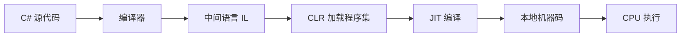

## 语言执行方式

编程语言按**执行方式**可以分为两大类：编译型语言和解释型语言。理解这一区别，有助于我们把握 Rust 在性能和部署方面的设计理念。

---

## 编译型语言

**编译型语言**的工作流程：

1. 开发者编写源代码
2. 使用 **编译器（Compiler）** 将源代码一次性翻译成机器码
3. 生成**可执行文件**（如 `.exe`、二进制文件）
4. 将可执行文件分发给用户，用户直接运行即可


**特点：**

- ✅ **运行速度快**：直接编译为机器码，无运行时翻译开销
- ✅ **无需运行时环境**：用户不需要安装编译器或解释器
- ✅ **编译期错误检查**：类型错误、语法错误在编译阶段就能发现
- ❌ **编译时间较长**：大型项目编译可能需要几分钟甚至更长
- ❌ **平台依赖**：不同操作系统/CPU 架构需分别编译

**代表语言：Rust、C、C++、Go**

### Rust 作为编译型语言

Rust 使用 **rustc** 编译器（底层基于 LLVM），将源代码编译为高效的机器码：

```rust
// main.rs
fn main() {
    println!("Hello, Rust!");
}
```

```bash
# 编译
rustc main.rs

# 运行生成的可执行文件
./main          # Linux/macOS
main.exe        # Windows
```

Rust 的编译器不仅生成高效的机器码，还在编译期进行了大量的**安全检查**（所有权、借用、生命周期等），确保运行时不会出现内存安全问题。

---

## 解释型语言

**解释型语言**的工作流程：

1. 开发者编写源代码
2. 将源代码副本直接分发给用户
3. 用户使用**解释器（Interpreter）**逐行翻译并执行


**特点：**

- ✅ **跨平台性好**：只要有对应平台的解释器，同一份源码到处可运行
- ✅ **开发效率高**：无需编译，修改代码后立刻运行
- ✅ **源码即分发**：用户可以查看和修改源代码
- ❌ **运行速度较慢**：每次执行都需要解释器参与翻译
- ❌ **需要运行时环境**：用户必须安装对应的解释器（Python、Node.js 等）
- ❌ **运行时错误**：类型错误只能在运行时发现

**代表语言：Python、JavaScript、Ruby、PHP**

### Python 示例

```python
# hello.py
print("Hello, Python!")
```

```bash
# 不需要编译，直接用解释器运行
python hello.py
```

用户必须安装 Python 解释器才能运行这段代码。

---

## 中间方法：C# / Java

除了纯编译和纯解释，还有一条**中间路线**，典型代表是 C# 和 Java。



### 工作流程

以 **C#** 为例：

| 阶段 | 说明 |
|------|------|
| ① 编译 | C# 源码 → **IL（Intermediate Language，中间语言）** |
| ② 分发 | 将 IL 程序集（`.dll` / `.exe`）分发给用户 |
| ③ 加载 | 用户机器上的 **CLR（公共语言运行时）** 加载程序集 |
| ④ JIT | **JIT（Just-In-Time）编译器** 将 IL 编译为本地机器码 |
| ⑤ 执行 | CPU 直接执行本地机器码 |

### Java 的类似流程

Java 采用类似的方式：`Java 源码 → 字节码（Bytecode） → JVM 加载 → JIT 编译 → 本地机器码`

### 中间方法的优缺点

| 优点 | 缺点 |
|------|------|
| ✅ 一次编译，到处运行（跨平台） | ❌ 需要安装运行时（CLR / JVM） |
| ✅ JIT 可针对具体 CPU 优化 | ❌ 首次运行有预热开销 |
| ✅ IL 可被反编译，但比纯源码难读 | ❌ 内存占用比原生编译高 |

---

## 三种方式对比

| 特性 | 编译型（Rust） | 解释型（Python） | 中间型（C#/Java） |
|------|:---:|:---:|:---:|
| 执行速度 | 🚀 最快 | 🐢 较慢 | 🚗 较快 |
| 启动速度 | ⚡ 即开即用 | 🔄 需要解释器 | ⏳ JIT 预热 |
| 跨平台 | 需分别编译 | ✅ 源码跨平台 | ✅ IL 跨平台 |
| 运行时依赖 | ❌ 无 | ✅ 需要解释器 | ✅ 需要 CLR/JVM |
| 编译期检查 | ✅ 完整 | ❌ 无 | ✅ 部分 |
| 源码保护 | ✅ 分发二进制 | ❌ 源码暴露 | ⚠️ IL 可反编译 |

---

## Rust 的选择

Rust 坚定地站在**编译型语言**阵营，并在这一基础上做了大量创新：

- **零成本抽象**：高级语法特性不会带来运行时开销
- **所有权系统**：编译期保证内存安全，无需垃圾回收（GC）
- **LLVM 后端**：享受 LLVM 多年的优化成果，生成高性能机器码
- **无运行时**：生成的二进制文件不依赖任何额外运行时环境

```rust
fn main() {
    let numbers: Vec<i32> = (1..=100).collect();
    let sum: i32 = numbers.iter().sum();
    println!("Sum: {}", sum);
}
```

这段代码会被 rustc + LLVM 优化为高效的机器指令，运行时没有垃圾回收停顿，没有解释器开销——这正是 Rust 适合系统编程和高性能场景的核心原因。
