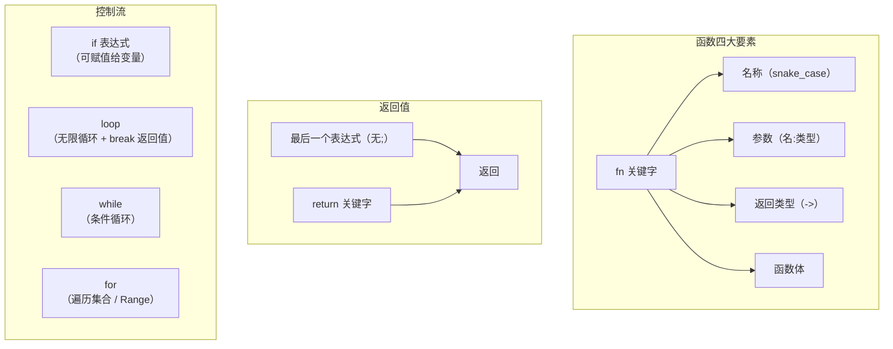

## 函数

Rust 函数由四个要素组成：**名称、参数、返回类型、函数体**。使用 `fn` 关键字声明，命名遵循 **snake_case** 规范（全小写，下划线分隔）。

### 基本结构

```rust
fn main() {
    another_function();
}

fn another_function() {
    // 函数体
}
```

- `fn` — 函数声明关键字
- 函数名和变量名统一采用 snake_case
- 调用方式：`func_name();`

### 参数

参数声明格式为 `参数名: 类型`，多个参数用逗号隔开：

```rust
fn another_function(x: i32, label: &str) {
    println!("{}: {}", label, x);
}

fn main() {
    another_function(42, "答案");
}
```

### 语句与表达式

这是 Rust 中非常重要的概念区分：

| 概念 | 定义 | 返回值 |
|------|------|:---:|
| **语句 Statement** | 执行某些操作，不返回值 | ❌ 无 |
| **表达式 Expression** | 计算并产生一个值 | ✅ 有 |

```rust
fn main() {
    let y = 6;   // let y = 6; 是语句，6 是表达式
}
```

**`{}` 代码块也是表达式：**

```rust
fn main() {
    let y = {
        let x = 3;
        x + 1       // ← 注意：没有分号！
    };
    println!("{y}");  // 4
}
```

> ⚠️ **关键规则**：表达式结尾**不加分号**，加了分号就变成了语句（不返回值）。

### 函数的返回值

使用 `->` 声明返回类型。两种返回方式：

1. **最后一个表达式**（不加分号，推荐）
2. **`return` 关键字**（提前返回时使用）

```rust
fn plus_one(x: i32) -> i32 {
    x + 1       // 表达式，不加分号，作为返回值
}

fn early_return(x: i32) -> i32 {
    if x > 100 {
        return x;   // 提前返回
    }
    x + 1           // 默认返回
}
```

---

## 控制流 Control Flow

根据条件决定是否执行某段代码。

### if 表达式

```rust
fn main() {
    let number = 3;

    if number < 5 {
        println!("小了");
    } else if number > 5 {
        println!("大了");
    } else {
        println!("正好");
    }
}
```

Rust 中 `if` **是表达式**，可以直接赋值给变量：

```rust
fn main() {
    let condition = true;
    let number = if condition { 5 } else { 6 };

    println!("{number}");  // 5
}
```

> ⚠️ **注意**：`if` 各分支 `{}` 的返回值类型**必须一致**，否则编译报错。

```rust
// ❌ 编译错误：分支类型不匹配
// let number = if condition { 5 } else { "six" };
```

---

## 循环

Rust 提供三种循环方式：`loop`、`while`、`for`。

### loop — 无限循环

```rust
fn main() {
    loop {
        println!("again!");
    }
}
```

| 控制关键字 | 作用 |
|-----------|------|
| `break` | 停止整个循环 |
| `continue` | 跳过本次迭代，进入下一次 |

#### loop 可以返回值

在 `break` 后加上值，可以把它从循环中"带出来"：

```rust
fn main() {
    let mut counter = 0;
    let result = loop {
        counter += 1;
        if counter == 10 {
            break counter * 2;
        }
    };

    println!("{result}");  // 20
}
```

#### 循环标签 — 跳出多层嵌套

用 `'标签名` 标注循环，配合 `break '标签名` 可直接跳出指定层级：

```rust
fn main() {
    let mut count = 0;

    'counting_up: loop {
        let mut remaining = 10;
        loop {
            if remaining == 9 {
                break;              // 跳出内层循环
            }
            if count == 2 {
                break 'counting_up; // 直接跳出外层循环
            }
            remaining -= 1;
        }
        count += 1;
    }

    println!("{count}");  // 2
}
```

### while — 条件循环

条件为真时持续执行：

```rust
fn main() {
    let mut number = 3;

    while number != 0 {
        println!("{number}");
        number -= 1;
    }
    println!("发射！");
}
```

### for — 遍历集合（最常用）

```rust
fn main() {
    let a = [10, 20, 30, 40, 50];

    for element in a {
        println!("值为：{element}");
    }
}
```

#### 使用 Range 执行指定次数

```rust
fn main() {
    for number in 1..4 {        // 1, 2, 3（不含 4）
        println!("{number}");
    }

    for number in 1..=4 {       // 1, 2, 3, 4（含 4）
        println!("{number}");
    }

    // 反向遍历
    for number in (1..4).rev() { // 3, 2, 1
        println!("{number}");
    }
}
```

| Range 写法 | 含义 |
|-----------|------|
| `1..4` | 1, 2, 3（不包含 4） |
| `1..=4` | 1, 2, 3, 4（包含 4） |
| `.rev()` | 反转顺序 |

---

## 三种循环对比

| 特性 | `loop` | `while` | `for` |
|------|:---:|:---:|:---:|
| 使用场景 | 无限循环 / 复杂控制 | 条件驱动 | 遍历集合 |
| 能否返回值 | ✅ `break val` | ❌ | ❌ |
| 循环标签 | ✅ | ✅ | ✅ |
| 安全性 | 需手动 break | 自动条件判断 | 自动遍历，无越界风险 |
| 推荐度 | 特定场景 | 较少使用 | ⭐ 最常用 |

---

## 总结



| 概念 | 一句话总结 |
|------|-----------|
| `fn` | 函数声明，snake_case 命名 |
| 参数 | `名:类型`，多参数逗号分隔 |
| 语句 vs 表达式 | 语句不返回值；表达式有返回值，**不加分号** |
| `->` | 声明返回类型 |
| `if` | 是表达式，可赋值，各分支类型必须一致 |
| `loop` | 无限循环，`break` 可返回值，支持标签跳出 |
| `while` | 条件为真时执行 |
| `for` | 遍历集合或 Range，最安全、最常用 |
