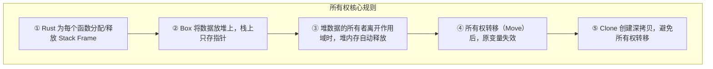

## 概述

**所有权（Ownership）** 是 Rust 最独特的特性——它是保证程序安全的机制。

> **安全** = 程序中没有**未定义行为（Undefined Behavior）**
>
> **未定义行为** = 程序执行结果不可预测、且不被编程语言规范所定义

Rust 的两个核心目标：

1. **基础目标**：确保程序永远不会有未定义行为
2. **次要目标**：在**编译时**而不是运行时防止未定义行为

### 不安全代码示例

```rust
fn read(y: bool) {
    if y {
        println!("y is true");
    }
}

fn main() {
    read(x);           // ❌ x 未定义就使用 → 未定义行为！
    let x = true;
}
```

编译器会拒绝这段代码——变量在声明之前被使用，Rust 不允许。

---

## 所有权作为内存安全的规范

### 变量存在于 Stack 中

更准确地说，存在于 **Stack Frame（栈帧）** 中。

```rust
fn main() {
    let n = 5;                    // L1
    let y = plus_one(n);          // L3
    println!("The value of y is: {y}");
}

fn plus_one(x: i32) -> i32 {
    x + 1                          // L2
}
```

程序运行时，Stack Frame 的变化：

| 步骤 | Stack 状态 |
|------|-----------|
| 进入 `main()` | `main` Stack Frame 建立，`n = 5` |
| 调用 `plus_one(n)` | `plus_one` Stack Frame 推到栈顶，`x = 5` |
| `plus_one` 返回 | `plus_one` Stack Frame 释放，弹出 |
| `main` 继续 | 结果赋值给 `y` |

> ⚠️ **关键规则**：最新的 Stack Frame 总是在栈顶部，执行完毕就释放。

#### Stack 上的数据复制

栈上数据遵循"拷贝"而非"移动"：

```rust
let a = 5;       // L1 — a = 5
let mut b = a;   // L2 — b = a（拷贝，不是移动）
b += 1;          // L3 — b = 6, a 依然是 5
```

`i32` 这种标量类型实现了 `Copy` trait，赋值时自动复制，而非转移所有权。

---

### Box 存活于 Heap 中

当数据较大时，在 Stack 上复制会造成浪费：

```rust
fn main() {
    let a = [0; 1_000_000];  // L1 — 100万元素的数组，放在栈上
    let b = a;               // L2 — 全部拷贝！4MB 数据复制
}
```

**使用 `Box` 将数据放在堆上**，Stack 只存指针：

```rust
fn main() {
    let a = Box::new([0; 1_000_000]);  // L1 — 堆上分配，栈上只存指针
    let b = a;                         // L2 — 只拷贝指针（所有权转移）
}
```

```
    修改前（栈复制）                    修改后（Box + 堆）
    ┌──────────┐                      ┌──────────┐
    │ a: 4MB   │  ← 复制开销巨大       │ a: ptr → │──→ ┌──────────┐
    ├──────────┤                      ├──────────┤    │ 4MB 数据  │
    │ b: 4MB   │                      │ b: ptr → │──→ └──────────┘
    └──────────┘                      └──────────┘    （堆上唯一一份）
```

---

## Rust 的内存管理

Rust 不允许手动管理内存，而是通过所有权系统自动管理。

### Stack — 自动管理

- 调用函数时，Rust 为其分配 Stack Frame
- 调用结束时，Rust 自动释放该 Stack Frame
- 程序员无需关心，编译器全权负责

### Box — 所有者管理释放

**几乎正确但非完全准确的描述**：

> 如果一个变量绑定到 Box，当 Rust 释放该变量的 frame 时，Rust 也会释放 Box 的堆内存。

**完全准确的描述**：

> 如果一个变量**拥有（own）**一个 Box，当 Rust 释放该变量的 frame 时，Rust 会释放该 Box 的堆内存。

```rust
fn main() {
    let a_num = 4;          // L1 — a_num = 4
    make_and_drop();        // L3
}

fn make_and_drop() {
    let a_box = Box::new(5); // L2 — 堆上分配 5，a_box 拥有它
}                            // a_box 离开作用域，堆内存自动释放
```

---

### 移动堆数据原则（Move）

> 如果变量 x 将堆数据的所有权**移动**给变量 y，移动后 x **不能再使用**。

```rust
let a = Box::new([0; 1_000_000]);
let b = a;
// a 不再拥有该 Box，所有权已转移给 b
```

#### 函数参数的 Move

```rust
fn main() {
    let first = String::from("Ferris");   // L1
    let full = add_suffix(first);          // L4 — first 的所有权移入函数
    println!("{full}");                    // ✅ 可以
}

fn add_suffix(mut name: String) -> String {
    // L2 — name 接手所有权
    name.push_str(" Jr.");                // L3
    name                                    // 返回，所有权移出
}
```

```
    first (L1)          add_suffix 内 (L2)           full (L4)
    ┌──────────┐         ┌──────────┐               ┌──────────┐
    │ ptr →────│──→ ... ─│→ ptr     │──→ ... ───────│→ ptr     │
    │ len: 6   │         │ len: 6   │               │ len: 10  │
    │ cap: 6   │         │ cap: 6   │               │ cap: 12  │
    └──────────┘         └──────────┘               └──────────┘
      "Ferris"             "Ferris"                   "Ferris Jr."
```

#### 移动后不能再使用

```rust
fn main() {
    let first = String::from("Ferris");   // L1
    let full = add_suffix(first);          // L4 — first 所有权移走
    println!("{full}, {first}");           // ❌ 编译错误！
    //                       ^^^^^ first 已被移动，不能再使用
}

fn add_suffix(mut name: String) -> String {
    name.push_str(" Jr.");
    name
}
```

---

### Clone 可避免移动

如果希望保留原变量的所有权，可以使用 `clone()` 创建一份**深拷贝**：

```rust
fn main() {
    let first = String::from("Ferris");            // L1
    let first_clone = first.clone();               // L2 — 深拷贝，两者独立
    let full = add_suffix(first_clone);            // first 依然有效！
    println!("{full}, {first}");                   // ✅ "Ferris Jr., Ferris"
}

fn add_suffix(mut name: String) -> String {
    name.push_str(" Jr.");
    name
}
```

```
    first                    first_clone (移入 add_suffix)
    ┌──────────┐             ┌──────────┐
    │ ptr →────│──→ "Ferris" │ ptr →────│──→ "Ferris Jr."
    │ len: 6   │             │ len: 10  │
    │ cap: 6   │             │ cap: 12  │
    └──────────┘             └──────────┘
      ✅ 仍可用               已移走（但 first 不受影响）
```

---

## 总结



| 概念 | 一句话总结 |
|------|-----------|
| Stack Frame | 函数调用自动分配，返回自动释放，变量存在其中 |
| `Box<T>` | 把数据放在堆上，栈只存指针，避免大对象复制 |
| Move | 堆数据所有权转移后，原变量无效，编译器禁止使用 |
| Clone | 深拷贝堆数据，原变量和新变量各自独立 |
| 释放原则 | 变量拥有 Box → frame 释放 → 堆内存自动 free |

- Rust 的所有权系统在**编译时**保证内存安全，没有 GC，也没有手动 `free`
- `Copy` 类型（如 `i32`）会自动复制；非 `Copy` 类型（如 `String`、`Box`）默认移动
- `clone()` 是显式的、有开销的操作——编译器不会隐式调用它
