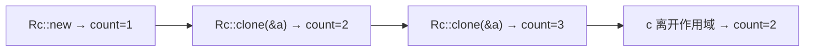

## 概述

**`Rc<T>`**（Reference Counting）是一种**引用计数指针**，用于在**单线程**场景下实现**多重所有权**。

在某些数据结构（如图形结构 `graph`）中，一个值可能同时被多个所有者持有。普通的所有权规则无法支持这种情况，而 `Rc<T>` 通过在 Heap 上分配数据并跟踪其**引用数量**来解决：当引用计数归零时，数据被自动清理。

---

## 使用场景

- 在 Heap 上分配数据，供程序的多个部分**读取**
- 在**编译时无法确定**哪个部分会最后完成对数据的使用
- **仅限单线程**场景

---

## 为什么需要 Rc\<T\>

### 问题的起源

之前在 `Box<T>` 中学习的 Cons List，当使用 `Box<T>` 时无法让两个 List 共享同一个尾部：

```rust
enum List {
    Cons(i32, Box<List>),
    Nil,
}

use crate::List::{Cons, Nil};

fn main() {
    let a = Cons(5, Box::new(Cons(10, Box::new(Nil))));
    let b = Cons(3, Box::new(a));   // a 的所有权转移给了 b
    let c = Cons(4, Box::new(a));   // ❌ a 已经移动，无法再次使用
}
```

> `Box<T>` 是单一所有权指针，`a` 的所有权在构造 `b` 时已经移动，`c` 无法再使用 `a`。

---

## 使用 Rc\<T\> 实现多重所有权

将 `Box<List>` 替换为 `Rc<List>` 即可让多个 List 共享同一份数据：

```rust
use std::rc::Rc;

enum List {
    Cons(i32, Rc<List>),
    Nil,
}

use crate::List::{Cons, Nil};

fn main() {
    let a = Rc::new(Cons(5, Rc::new(Cons(10, Rc::new(Nil)))));
    let b = Cons(3, Rc::clone(&a));  // ✅ a 不被移动，只是引用计数 +1
    let c = Cons(4, Rc::clone(&a));  // ✅ a 可以继续被共享
}
```

> `Rc::clone(&a)` **不会执行深拷贝**，只增加引用计数。这是 Rust 的惯例：`Rc::clone` 只做浅层的引用计数操作，而 `a.clone()` 通常意味着深拷贝。

---

## 查看引用计数：Rc::strong_count

使用 `Rc::strong_count` 可以查看当前强引用的数量。初始创建时计数为 `1`：

```rust
fn main() {
    let a = Rc::new(Cons(5, Rc::new(Cons(10, Rc::new(Nil)))));
    println!("count after creating a = {}", Rc::strong_count(&a));  // 1

    let b = Cons(3, Rc::clone(&a));
    println!("count after creating b = {}", Rc::strong_count(&a));  // 2

    {
        let c = Cons(4, Rc::clone(&a));
        println!("count after creating c = {}", Rc::strong_count(&a));  // 3
    }  // c 离开作用域，计数 -1

    println!("count after c goes out of scope = {}", Rc::strong_count(&a));  // 2
}
```

**输出：**

```
count after creating a = 1
count after creating b = 2
count after creating c = 3
count after c goes out of scope = 2
```

引用计数的变化：



---

## Rc\<T\> 通过不可变引用共享数据

`Rc<T>` 实现的是**不可变共享**——通过 `Rc<T>` 持有的数据是**只读**的：

```rust
use std::rc::Rc;

fn main() {
    let s = Rc::new(String::from("hello"));
    // s.push_str(" world");  // ❌ Rc<T> 内部数据不可变
    let t = Rc::clone(&s);
    println!("s: {}, t: {}", s, t);  // ✅ 可以读取
}
```

> 如果需要内部可变性（在共享的同时也能修改数据），需要结合 `RefCell<T>` 使用——这将在后续笔记中介绍。

---

## 总结

| 要点 | 说明 |
|------|------|
| **用途** | 单线程下的多重所有权 |
| **引入** | `use std::rc::Rc;` |
| **创建** | `Rc::new(value)` |
| **克隆（共享）** | `Rc::clone(&rc)` — 只增计数，不深拷贝 |
| **查看计数** | `Rc::strong_count(&rc)` |
| **清理时机** | 引用计数归零时自动清理（通过 `Drop` trait） |
| **限制** | 只适用**单线程**；不可变共享 |
| **内部可变性** | 需要搭配 `RefCell<T>` 使用 |

`Rc<T>` 解决了 `Box<T>` 单一所有权的限制，使得同一个数据可以被多个部分共享。但它只提供不可变访问，且限于单线程。对于更复杂的场景，后续还将学习 `RefCell<T>`（内部可变性）和 `Arc<T>`（多线程引用计数）。
