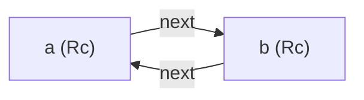
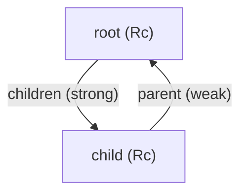

## 概述

### 内存泄漏

**内存泄漏**是指永远不会被清理掉的内存。Rust 的安全保证使得**意外**的内存泄漏很难发生，但**不是不可能**。

> 完全防止内存泄漏并不是 Rust 的保证之一。但内存泄漏是**内存安全**的——它不会导致悬垂指针或数据竞争等问题。

---

## 引用循环示例

使用 `Rc<T>` 和 `RefCell<T>` 的组合可能意外地制造**引用循环**（reference cycle），导致数据永远不被释放。

### 构造循环引用

以下示例模拟两个节点互相引用，形成一个循环：

```rust
use std::cell::RefCell;
use std::rc::Rc;

#[derive(Debug)]
struct Node {
    value: i32,
    next: RefCell<Option<Rc<Node>>>,
}

fn main() {
    let a = Rc::new(Node {
        value: 5,
        next: RefCell::new(None),
    });

    let b = Rc::new(Node {
        value: 10,
        next: RefCell::new(None),
    });

    // 让 a 指向 b
    *a.next.borrow_mut() = Some(Rc::clone(&b));
    // 让 b 指向 a —— 形成循环！
    *b.next.borrow_mut() = Some(Rc::clone(&a));

    // a 和 b 互相引用，引用计数永远 >= 2，永远不会被释放
    println!("a ref count = {}", Rc::strong_count(&a));  // 2
    println!("b ref count = {}", Rc::strong_count(&b));  // 2
}
```

循环关系：



> 即使 `main` 结束、`a` 和 `b` 离开作用域，它们的引用计数仍为 `1`（互相持有），永远不会归零，堆上的数据永远不会被释放。

---

## 引用循环的影响与预防

| 场景 | 影响 |
|------|------|
| 简单程序 | 影响有限，进程结束后 OS 回收内存 |
| 复杂程序 | 可能导致严重的内存耗尽 |

### 预防策略

- 引用循环**不易发生**但确实可能
- 使用 `RefCell<T>` 和 `Rc<T>` 嵌套组合时需**特别注意**
- Rust **无法自动检测**引用循环，这属于**逻辑错误**
- 应通过**自动化测试**和**代码审查**来发现和避免

---

## 另一种策略：重组数据结构

通过区分**所有权引用**和**非所有权引用**来重组数据结构，可以避免引用循环。

核心原则：只有**所有权关系**会影响值是否可被丢弃。

- 链表结构中 `Cons` 变体**必须**拥有 `List`，所以这种方法不适用
- **图结构**（如父子节点关系）是展示非所有权关系防止循环的更好例子

---

## 防止引用循环：将 Rc\<T\> 转换为 Weak\<T\>

### 强引用 vs 弱引用

| 类型 | 创建方式 | 影响计数 | 作用 |
|------|---------|---------|------|
| **强引用** `Rc<T>` | `Rc::clone(&rc)` | `strong_count + 1` | 表示**所有权**，阻止清理 |
| **弱引用** `Weak<T>` | `Rc::downgrade(&rc)` | `weak_count + 1` | **不表示所有权**，不影响清理时机 |

> `Rc<T>` 指向的值只有在 **`strong_count` 为 0** 时才会被清理。弱引用不会导致循环引用，因为它们不影响清理。

### Weak\<T\> 的使用

`Weak<T>` 不能直接访问其指向的值，需要通过 `upgrade` 方法检查该值是否仍然存在：

```rust
use std::cell::RefCell;
use std::rc::{Rc, Weak};

let strong = Rc::new(42);
let weak: Weak<i32> = Rc::downgrade(&strong);

match weak.upgrade() {
    Some(rc) => println!("值仍存在：{}", rc),  // ✅ 42
    None => println!("值已被释放"),
}
```

- 如果 `Rc<T>` 仍存在，`upgrade()` 返回 `Some(Rc<T>)`
- 如果 `Rc<T>` 已被清理，返回 `None`

---

## 实际应用：树形结构

树形结构是 `Weak<T>` 的典型应用场景——父节点**拥有**子节点（强引用），子节点**引用**父节点（弱引用）。

```rust
use std::cell::RefCell;
use std::rc::{Rc, Weak};

#[derive(Debug)]
struct Node {
    value: i32,
    parent: RefCell<Weak<Node>>,       // 弱引用 → 父节点
    children: RefCell<Vec<Rc<Node>>>,  // 强引用 → 子节点
}

fn main() {
    // 根节点
    let root = Rc::new(Node {
        value: 0,
        parent: RefCell::new(Weak::new()),  // 空弱引用
        children: RefCell::new(vec![]),
    });

    println!("root strong = {}, weak = {}",
        Rc::strong_count(&root),
        Rc::weak_count(&root));
    // root strong = 1, weak = 0

    // 创建子节点
    let child = Rc::new(Node {
        value: 1,
        parent: RefCell::new(Rc::downgrade(&root)),  // 父 → 弱引用
        children: RefCell::new(vec![]),
    });

    root.children.borrow_mut().push(Rc::clone(&child));

    println!("root strong = {}, weak = {}",
        Rc::strong_count(&root),
        Rc::weak_count(&root));
    // root strong = 1, weak = 1

    println!("child parent = {:?}", child.parent.borrow().upgrade());
    // child parent = Some(Node { value: 0, ... })
}
```

### 创建作用域验证清理

```rust
{
    let leaf = Rc::new(Node {
        value: 2,
        parent: RefCell::new(Rc::downgrade(&root)),
        children: RefCell::new(vec![]),
    });

    root.children.borrow_mut().push(Rc::clone(&leaf));

    println!("root strong in scope = {}", Rc::strong_count(&root));  // 2
}  // leaf 离开作用域

println!("root strong out of scope = {}", Rc::strong_count(&root));  // 1
```

> 子节点 `leaf` 离开作用域后，强引用计数恢复正常，`weak_count` 也会在 `Rc<T>` 被 drop 后自动减少。

### 可视化强弱引用计数



- `root → child`：强引用（`strong_count`），child 不会被释放
- `child → parent`：弱引用（`weak_count`），不影响 root 的清理
- 即使 `root` 的所有强引用归零，它也能正常释放——**不会形成循环**

---

## 总结

| 要点 | 说明 |
|------|------|
| **内存泄漏** | Rust 难以意外泄漏，但不能完全防止 |
| **引用循环** | `Rc<T>` 互相引用导致 `strong_count` 永远不为 0 |
| **检测方式** | 编译器无法检测，需要测试和代码审查 |
| **强引用** | `Rc::clone` → `strong_count + 1`，拥有所有权 |
| **弱引用** | `Rc::downgrade` → `weak_count + 1`，不拥有所有权 |
| **访问弱引用** | `weak.upgrade()` → `Option<Rc<T>>` |
| **打破循环** | 将其中一个方向改为 `Weak<T>` 即可 |
| **经典场景** | 树形结构：父 → 子（Strong），子 → 父（Weak） |

通过 `Weak<T>` 打破循环引用是 Rust 中处理复杂数据结构的核心技巧。它与 `Rc<T>` 和 `RefCell<T>` 一起，构成了单线程下灵活且安全的数据共享方案。
