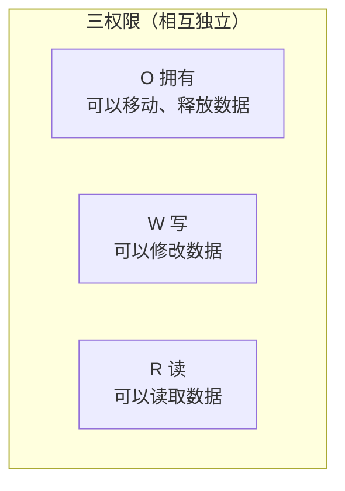
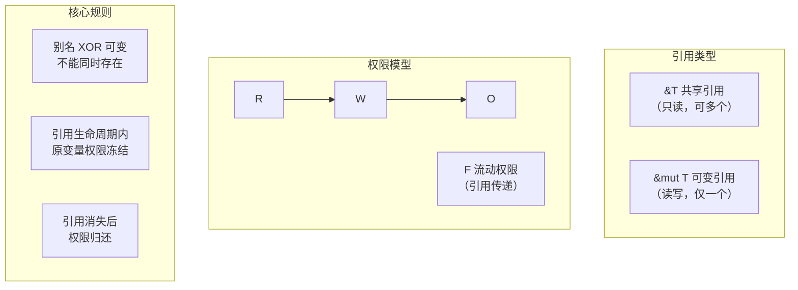

## 传参所有权改变

当函数参数是 `String` 等非 Copy 类型时，所有权会被**移入**函数，调用方再也无法使用：

```rust
fn main() {
    let m1 = String::from("Hello");
    let m2 = String::from("World");
    greet(m1, m2);                          // L2 — m1, m2 所有权移入函数
    let s = format!("{} {}", m1, m2);       // ❌ Error: m1 and m2 are moved
}

fn greet(g1: String, g2: String) {
    println!("{g1} {g2}!");                // L1
}
```

### 变通方案：把所有权归还

通过返回值把所有权"还给"调用方：

```rust
fn main() {
    let m1 = String::from("Hello");
    let m2 = String::from("World");         // L1
    let (m1_again, m2_again) = greet(m1, m2);
    let s = format!("{} {}", m1_again, m2_again); // L2 ✅
}

fn greet(g1: String, g2: String) -> (String, String) {
    println!("{g1} {g2}!");
    (g1, g2)
}
```

这能工作但**非常笨拙**——每次调用都要把所有权传进去又传出来。

---

## 引用传参，所有权不改变

**引用（Reference）是没有所有权的指针。** 使用 `&` 创建引用，用 `&T` 作为参数类型：

```rust
fn main() {
    let m1 = String::from("Hello");
    let m2 = String::from("World");          // L1
    greet(&m1, &m2);                         // L3 — 传引用，不转移所有权
    let s = format!("{} {}", m1, m2);        // ✅ m1, m2 依然有效
}

fn greet(g1: &String, g2: &String) {         // L2
    println!("{g1} {g2}!");
}
```

**借用（Borrowing）**：通过引用临时访问数据而不取得所有权，就像"借书"——用完后要还回去。

| 方式 | 所有权变化 | 调用后原变量 |
|------|:---:|:---:|
| 传值 `f(x)` | ✅ 转移 | ❌ 不可用 |
| 传引用 `f(&x)` | ❌ 不转移 | ✅ 仍可用 |
| 归还所有权 `let (x,) = f(x)` | 出→进 | ✅ 可用（但繁琐） |

---

## 解引用指针访问数据

解引用运算符 `*` 用于获取指针指向的实际数据：

```rust
let mut x: Box<i32> = Box::new(1);
let a: i32 = *x;       // 解引用 Box，得到 i32 值
*x += 1;                // 通过解引用修改堆上的值

let r1: &Box<i32> = &x;
let b: i32 = **r1;     // 两层解引用：&Box<i32> → Box<i32> → i32

let r2: &i32 = &*x;    // &* 看似抵消，实际是：先解引用得值，再对其引用
let c: i32 = *r2;
```

### 隐式解引用

Rust 在方法调用中支持**自动（隐式）解引用**：

```rust
let x = Box::new(-5);
let abs = x.abs();     // 隐式解引用：Box<i32> → i32，然后调用 i32::abs()
                       // 等价于 (*x).abs()
```

同理，`&` 和 `*` 在方法调用时也可以自动插入，支持多层嵌套。

---

## 别名和可变性不可同时存在

这是 Rust 引用规则的最核心约束：

> **在任意给定时间，只能拥有以下两者之一：**
> - 任意数量的不可变引用（共享引用）
> - 恰好一个可变引用（独占引用）

### 为什么？

```rust
let mut v: Vec<i32> = vec![1, 2, 3];
let num: &i32 = &v[2];   // L1 — 不可变引用指向 v[2]
v.push(4);                // L2 — 可变操作！可能导致 v 重新分配内存
println!("{num}");        // L3 — num 可能指向已释放的旧内存 → 未定义行为！
```

`v.push(4)` 可能触发 Vec 扩容，旧内存被释放，`num` 变成**悬垂指针（dangling pointer）**。Rust 编译时直接拒绝这种代码。

### 共享引用 vs 所有权移动

```rust
fn main() {
    let x = Box::new(1);
    let y = x;                 // 所有权移动
    // println!("{x}");       // ❌ x 已失效

    let r1 = &y;               // 共享引用
    let r2 = &y;               // ✅ 多个共享引用同时存在
    println!("{r1} {r2}");
}
```

| 操作 | 原变量状态 | 可多个 |
|------|-----------|:---:|
| `let y = x;`（移动） | ❌ 失效 | ❌ |
| `let r = &x;`（引用） | ✅ 仍可用 | ✅ |

---

## 借用检查器的权限模型

Rust 通过**借用检查器（Borrow Checker）**在编译时验证引用安全性。核心使用 **三权限模型**：

| 权限 | 含义 | 赋予方式 |
|------|------|---------|
| **R**（Read） | 读取数据 | 默认 |
| **W**（Write） | 修改数据 | `mut` 关键字 |
| **O**（Own） | 移动 / 释放数据 | 变量绑定 |



- **O（拥有）**：可以对数据做移动和释放操作
- **W（写）**：`mut` 赋予修改权限
- **R（读）**：最基础权限，几乎所有变量默认拥有

> ℹ️ O、W、R 是**三个相互独立的权限**。一个变量拥有 O，不代表自动拥有 W 或 R；三者可以由不同变量分别持有。

### 权限定义在"位置"上

**位置（Place）** 是任何可以放在赋值语句左侧的东西：

| 位置类型 | 示例 |
|----------|------|
| 变量 | `a` |
| 解引用 | `*a` |
| 数组访问 | `a[0]` |
| 字段访问 | `a.0` |
| 组合 | `(*a[0]).field` |

**位置在不使用时，会失去权限。**

### 每个操作需要特定权限

```rust
let mut v: Vec<i32> = vec![1, 2, 3];
let num: &i32 = &v[2];    // 不可变借用：v 的 W/O 权限被"冻结"了
v.push(4);                 // 需要 v 的 W 权限 ← 但 W 已被借用冻结！
println!("{*num}");       // ❌ 编译错误
```

借用检查器的推理：
1. `&v[2]` 创建了一个不可变借用，`v` 的 **W（写）和 O（拥有）权限被暂时冻结**，只剩 R（读）
2. `v.push(4)` 需要 `v` 的 W 权限来修改 Vec
3. 但 `v` 当前只有 R → 编译失败

> ℹ️ O、W、R 是三个相互独立的权限。不可变借用会临时冻结被借用者的 W 和 O——这就是为什么 `v.push(4)` 在 `&v[2]` 存活期间不能执行。

---

## 可变引用 `&mut`

**可变引用**提供对数据的**唯一且非拥有**的访问：

| 引用类型 | 特点 | 同时存在 |
|----------|------|:---:|
| `&T`（共享引用） | 只读 | ✅ 任意多个 |
| `&mut T`（独占引用） | 可读写，不获取所有权 | ❌ 仅一个 |

```rust
let mut s = String::from("hello");
let r1 = &mut s;     // ✅ 可变引用
r1.push_str(" world");

// let r2 = &s;      // ❌ 不能同时有共享引用
// let r3 = &mut s;  // ❌ 也不能再有可变引用

println!("{r1}");
```

### 可变引用的临时降级

可变引用在使用后可以"降级"，释放 W 权限，之后可再借出不可变引用：

```rust
let mut data = 42;
let r_mut = &mut data;
*r_mut += 1;          // 最后一次使用 r_mut
// r_mut 的 W 权限在这里被"归还"

let r_ref = &data;     // ✅ 现在可以借不可变引用了
println!("{r_ref}");
```

---

## 权限在引用生命周期结束时返回

引用存在期间，原变量的某些权限被暂时"冻结"；引用消失后，权限恢复。

```rust
let mut x = 5;
{
    let r = &mut x;   // x 的 W 权限暂借给 r
    *r += 1;          // 通过 r 修改
}                     // r 离开作用域，W 权限归还 x

x += 1;               // ✅ x 恢复 W 权限，可以修改
```

> ⚠️ **关键规则**：数据必须在所有引用的存活期间保持一致和有效。

---

## 流动权限 F

除了 R/W/O，还有一个特殊权限 **F（Flow）**：

> **F（流动权限）**：当表达式使用输入引用或返回输出引用时，需要 F 权限。

```rust
fn first_word(s: &String) -> &str {
    // s 需要 F 权限，因为返回的引用依赖于 s
    &s[..]
}
```

### 为什么需要 F 权限？

```rust
fn dangle() -> &String {
    let s = String::from("hello");
    &s    // ❌ 编译错误：s 会被释放，返回的引用无效
}         // s 在这里丢失 O 权限（被释放），&s 失去 F 权限
```

借用检查器发现：
1. `s` 在函数结束时被释放（O 权限消失）
2. 返回的引用 `&s` 需要 `s` 保持存活
3. `s` 不具有 F 权限 → 编译错误

这就是为什么 Rust 需要**生命周期标注**——帮助借用检查器理解不同引用之间的关系。但那是另一篇文章的主题了。

---

## 总结



| 概念 | 一句话总结 |
|------|-----------|
| `&T` | 共享引用，只读，不转移所有权，可多个同时存在 |
| `&mut T` | 独占引用，可读可写，同一时刻只能有一个 |
| `*` | 解引用运算符，获取指针指向的数据 |
| 借用检查器 | 编译时验证 R/W/O/F 权限，防止悬垂指针 |
| 别名 XOR 可变 | 有共享引用就不能有可变引用，反之亦然 |
| F 权限 | 确保返回的引用不指向已释放的数据 |
