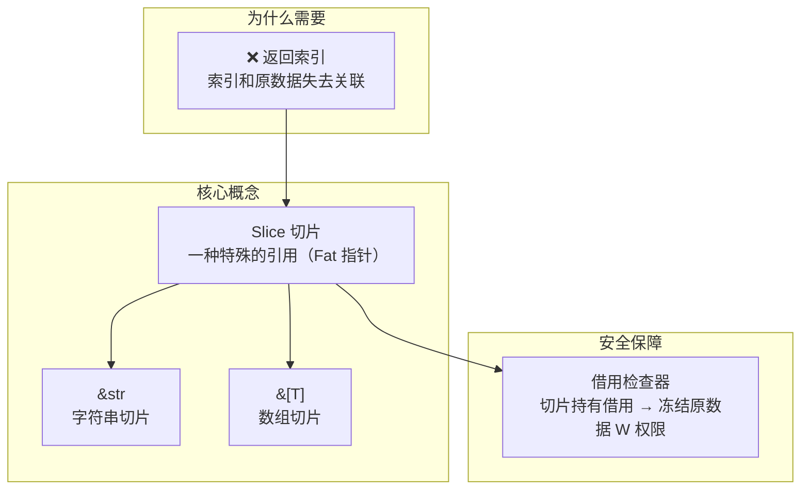

## 为什么需要切片？

先看一个**有隐患**的写法——返回索引而非引用：

```rust
fn main() {
    let mut s = String::from("hello world");
    let word = first_word(&s);  // 返回空格索引：5
    s.clear();                  // s 清空后，索引 5 毫无意义！
    // word 变成了无效数据
}

fn first_word(s: &String) -> usize {
    let bytes = s.as_bytes();
    for (i, &item) in bytes.iter().enumerate() {
        if item == b' ' {
            return i;
        }
    }
    s.len()
}
```

`word` 只是孤立的索引 `5`，和原字符串失去了关联——`s.clear()` 后索引成为"悬挂数字"。

### 切片带来的安全绑定

把返回值改为**切片引用** `&str`，让它和原字符串保持编译期关联：

```rust
fn main() {
    let mut s = String::from("hello world");
    let word = first_word(&s);   // 返回 &str 切片
    // s.clear();                // ❌ 编译错误！
    //  ^^^^^^^^^ word 持有 s 的不可变借用，无法对 s 做可变操作
    print!("{}", word);
}

fn first_word(s: &String) -> &str {
    let bytes = s.as_bytes();
    for (i, &item) in bytes.iter().enumerate() {
        if item == b' ' {
            return &s[0..i];
        }
    }
    &s[..]
}
```

> ✅ 借用检查器阻止了 `s.clear()` ——切片 `word` 持有 `s` 的不可变借用，`s` 的 W 权限被冻结。

---

## 什么是 Slice？

**Slice（切片）是一种特殊的引用类型**——它不拥有数据，只是数据的"一部分视图"。

| 性质 | 说明 |
|------|------|
| **不拥有数据** | Slice 是引用，不负责释放 |
| **部分视图** | 指向连续数据中的一段 |
| **Fat 指针** | 包含：指针 + 长度（两个 `usize`） |
| **影响权限** | 和被引用数据共享借用规则 |

### 四种 Slice 类型

| Slice 类型 | 数据来源 | 示例 |
|-----------|----------|------|
| `&str` | `String` / 字符串字面量 | `&s[0..5]` |
| `&[T]` | `Vec<T>` / 数组 `[T; N]` | `&v[1..4]` |
| `&[u8]` | 字节数据 | `&bytes[..]` |
| `&OsStr` | OS 字符串（少见） | — |

### Fat 指针的内存布局

普通引用 `&String` 只存一个指针（thin pointer），切片引用是 **fat 指针**：

```
    &String（thin）              &str（fat）
    ┌──────────┐               ┌──────────┬──────────┐
    │ ptr ────┐│               │ ptr ────┐│ len: 5   │
    └──────────┘               └──────────┴──────────┘
         │                           │
         ▼                           ▼
    ┌────────────────┐          ┌─────────┐
    │ "hello world"  │          │ "hello" │
    │ ptr / len / cap│          └─────────┘
    └────────────────┘          只指向其中 5 个字节
```

> `&String`：1 个 `usize`（指针）
> `&str`：2 个 `usize`（指针 + 长度）

---

## 创建切片：Range 语法

使用 `[起始索引 .. 结束索引]`，**左闭右开** `[start, end)`。

```rust
fn main() {
    let s = String::from("hello");
    let slice = &s[0..2];  // "he"
    let slice = &s[..2];   // "he"（从 0 开始可省略起始）

    let len = s.len();
    let slice = &s[3..len]; // "lo"
    let slice = &s[3..];    // "lo"（到末尾可省略结束）

    let slice = &s[0..len]; // "hello"
    let slice = &s[..];     // "hello"（全范围）
}
```

| 写法 | 含义 |
|------|------|
| `&s[0..5]` | 索引 0..5（不含 5） |
| `&s[..5]` | 从开头到索引 5 |
| `&s[3..]` | 从索引 3 到末尾 |
| `&s[..]` | 整个字符串 |

> ⚠️ **UTF-8 边界警告**：字符串切片的索引必须落在有效的 UTF-8 字符边界上，切在多字节字符中间会导致 panic。

---

## 字符串字面量与 `&str`

字符串字面量本身就是 `&str` 类型，因此可以直接传入接受 `&str` 的函数：

```rust
fn main() {
    let mut s = String::from("hello world");
    let word = first_word(&s);

    let lit = "Hello Rust";       // 字面量类型是 &str
    first_word(lit);               // ✅ 直接传入，无需 &String
}

fn first_word(s: &str) -> &str {   // 参数改为 &str，更通用！
    let bytes = s.as_bytes();
    for (i, &item) in bytes.iter().enumerate() {
        if item == b' ' {
            return &s[0..i];
        }
    }
    &s[..]
}
```

> ✅ 参数用 `&str` 比 `&String` 更好——`&String` 可以通过**自动解引用强制转换（Deref Coercion）**变成 `&str`，反之不行。`&str` 更通用。

---

## 数组切片

切片不仅用于字符串，也适用于数组和 Vec：

```rust
fn main() {
    let a = [1, 2, 3, 4, 5];
    let slice = &a[1..4];
    assert_eq!(slice, &[2, 3, 4]);  // ✅
}
```

`&a[1..4]` 的类型是 `&[i32]`——指向数组 a 中三个元素的切片引用。

### Vec 同理

```rust
fn main() {
    let v = vec![10, 20, 30, 40, 50];
    let slice: &[i32] = &v[1..=3];
    assert_eq!(slice, &[20, 30, 40]);

    // slice 也可以传给接受 &[T] 的函数
    let sum: i32 = slice.iter().sum();
    println!("{sum}");  // 90
}
```

---

## 总结



| 概念 | 一句话总结 |
|------|-----------|
| 切片 | 不拥有数据的"部分视图"，是 Fat 指针（指针 + 长度） |
| `&str` | 字符串切片，比 `&String` 更通用，字面量就是 `&str` |
| `&[T]` | 通用数组切片，适用于数组和 Vec |
| Range 语法 | `[start..end]` 左闭右开，可省略起止 |
| Fat 指针 | 2 个 usize：指针 + 长度（普通引用只 1 个） |
| 安全保证 | 切片持有借用，阻止原数据被修改/释放 |
| UTF-8 边界 | 字符串切片必须在有效字符边界上，否则 panic |
