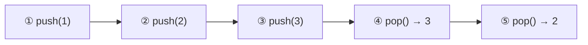
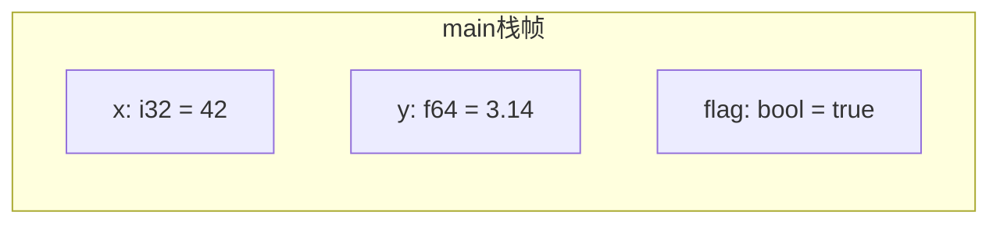
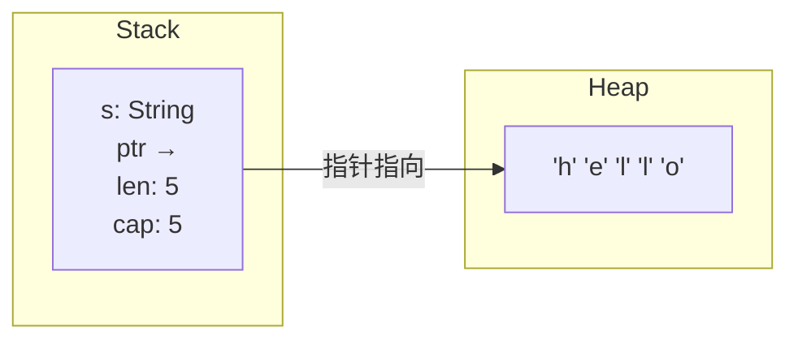
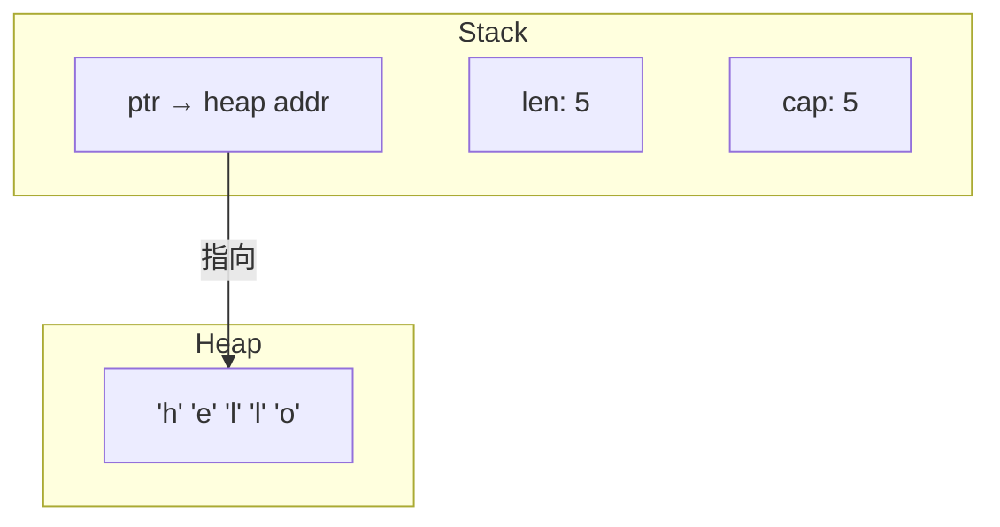
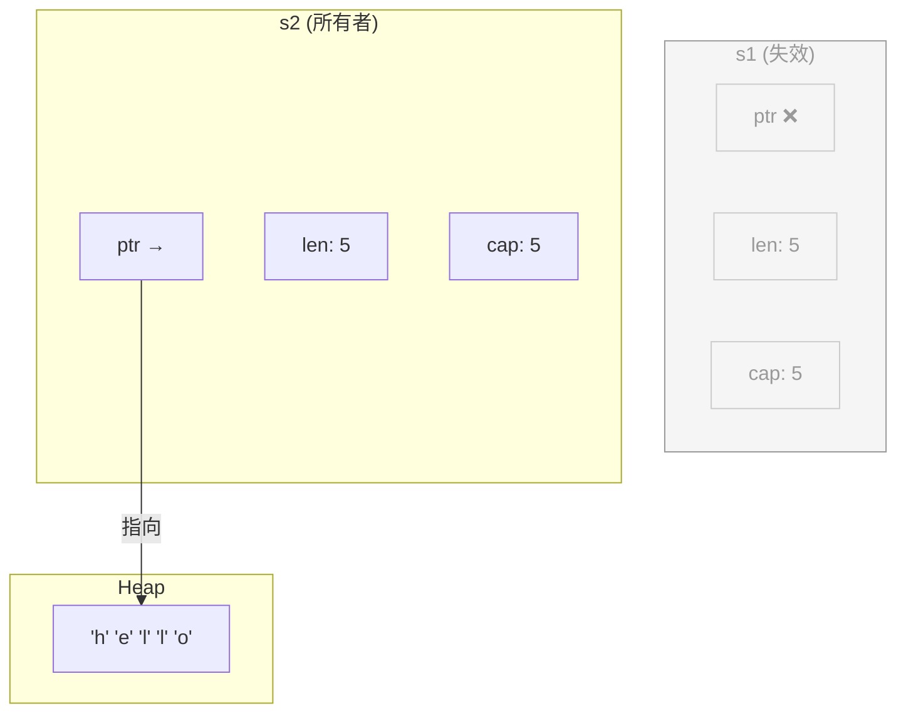
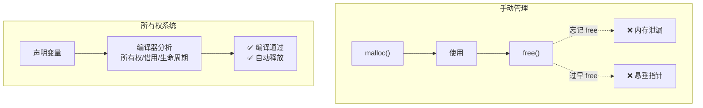

## 内存概述

程序运行时，操作系统会为它分配内存。Rust 程序使用的内存主要分为两大区域：

- **Stack（栈）** — 局部变量、函数调用上下文
- **Heap（堆）** — 动态分配的数据

理解两者的区别，是掌握 Rust 所有权系统的前提。

---

## Stack（栈）

栈是一种 **后进先出（LIFO）** 的数据结构，就像一叠盘子：最后放上去的，最先被拿走。



### 栈的特点

| 特性 | 说明 |
|------|------|
| 分配方式 | **数据大小必须在编译时已知** |
| 速度 | 🚀 极快，CPU 直接操作栈指针 |
| 管理 | 自动管理，函数返回时自动释放 |
| 大小限制 | 相对较小（通常几 MB） |
| 存储内容 | 固定大小的值：整数、浮点数、布尔、指针等 |

### Rust 中存储在栈上的数据

```rust
fn main() {
    let x: i32 = 42;        // i32 — 固定 4 字节，放栈上
    let y: f64 = 3.14;      // f64 — 固定 8 字节，放栈上
    let flag: bool = true;  // bool — 放栈上

    // x、y、flag 都在 main() 的栈帧中
    // 函数返回时自动回收
}
```

栈帧示意：



---

## Heap（堆）

堆是一块更大的内存池，用于存放**编译时大小未知**或**运行时可能变化**的数据。

### 堆的特点

| 特性 | 说明 |
|------|------|
| 分配方式 | 运行时动态请求一块内存 |
| 速度 | 🐢 比栈慢，需要查找足够大的空闲块 |
| 管理 | 需手动或通过所有权机制管理 |
| 大小限制 | 远大于栈（受物理内存 + 虚拟内存限制） |
| 存储内容 | 动态大小的数据：String、Vec、Box 等 |

### Rust 中存储在堆上的数据

```rust
fn main() {
    let s = String::from("hello");
    // String 的数据 "hello" 存在堆上
    // s 本身（指针、长度、容量）存在栈上
}
```

---

## 栈与堆的关系

栈和堆不是割裂的——栈上的数据经常**指向**堆上的数据。



### 图解 String 的内存布局

```rust
let s = String::from("hello");
```



- **栈上**存储 String 的三个字段：指针、长度、容量（共 24 字节，固定大小）
- **堆上**存储实际的 UTF-8 字符串数据 "hello"

### 多变量共享同一堆数据的陷阱

```rust
let s1 = String::from("hello");
let s2 = s1;
// 此时 s1 已经失效！
// println!("{}", s1); // ❌ 编译错误：s1 所有权已转移给 s2
```



Rust 通过 **move（移动）** 语义，确保同一时刻只有一份堆数据的所有者，防止双重释放（double free）。

---

## Rust 中的内存管理：所有权系统

Rust 不需要垃圾回收器（GC），也不依赖手动 `malloc` / `free`。它通过一套**所有权规则**在编译期保证内存安全。

### 所有权三大规则

| 规则 | 说明 |
|------|------|
| ① 每个值有且仅有一个**所有者** | 值绑定到一个变量 |
| ② 同一时刻只能有一个所有者 | 不能同时有两个变量拥有同一块数据 |
| ③ 所有者离开作用域，值被释放 | 编译器自动插入 `drop` 调用 |

### 示例

```rust
{
    let s = String::from("hello");
    // s 拥有堆上的 "hello"
    // ...使用 s...
} // s 离开作用域，堆内存自动释放（调用 drop）
```

### 对比：Rust vs 其他语言

| 内存管理方式 | 语言 | 特点 |
|-------------|------|------|
| **手动管理** | C/C++ | 程序员负责 malloc/free，易出错 |
| **垃圾回收** | Java, Go, Python | 运行时 GC，有停顿和内存开销 |
| **所有权系统** | Rust | 编译期保证安全，无运行时开销 |



---

## 总结

| 对比维度 | Stack（栈） | Heap（堆） |
|----------|:---------:|:---------:|
| 分配条件 | 编译时大小已知 | 运行时动态分配 |
| 速度 | 🚀 极快 | 🐢 较慢 |
| 管理方式 | 自动压栈/弹栈 | 所有权自动释放 |
| 大小 | 几 MB | GB 级别 |
| 典型用途 | i32, f64, bool, 指针 | String, Vec, Box, HashMap |
| 数据访问 | CPU 缓存友好 | 可能跨内存页 |

- **栈**适合小而固定的数据——Rust 默认将基本类型放在栈上
- **堆**适合大有动态的数据——`String`、`Vec<T>`、`Box<T>` 等
- Rust 通过**所有权**（ownership）、**借用**（borrowing）、**生命周期**（lifetimes）三大机制，在编译期就决定了每块堆内存的释放时机，做到"没有 GC，也没有内存泄漏"
